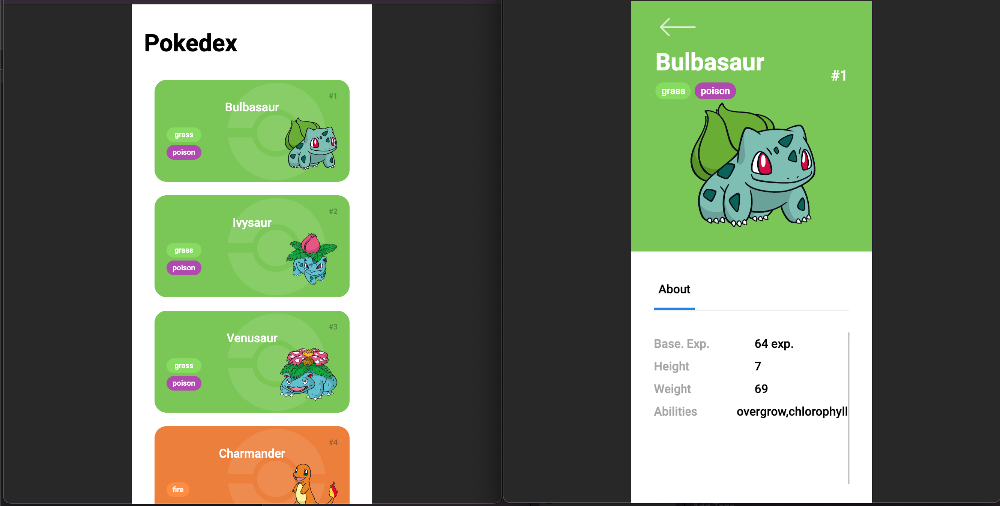

# Trilha JS Developer - Pokedex

<h4>Projeto foi desenvolvido como exercício do bootcamp satander - angular & java da DIO. Com intuito de práticar o Javascript e o desafio proposto é implementar a tela de detalhes dos pokemons.</h4>

# Implementações

- Estilização dos cards na página inicial
- Acesso das informações via PokeAPI
- Infinite Scroll
- Página de detalhes dos Pokémons
- Responsividade

# Tecnologias utilizadas

- HTML
- CSS
- Javascript
- Git

# Contato

email: lft.thomaz@gmail.com
